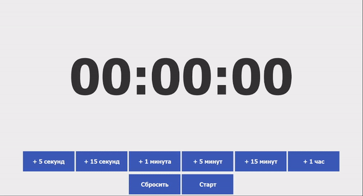
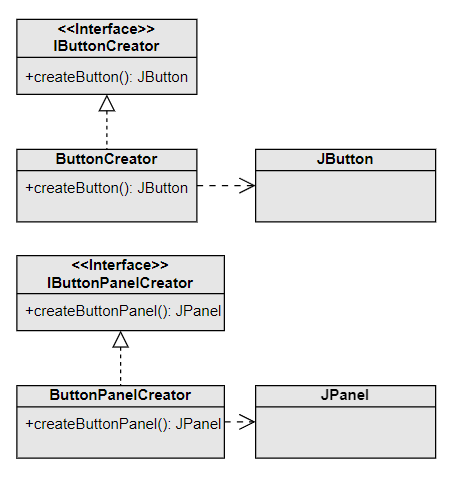
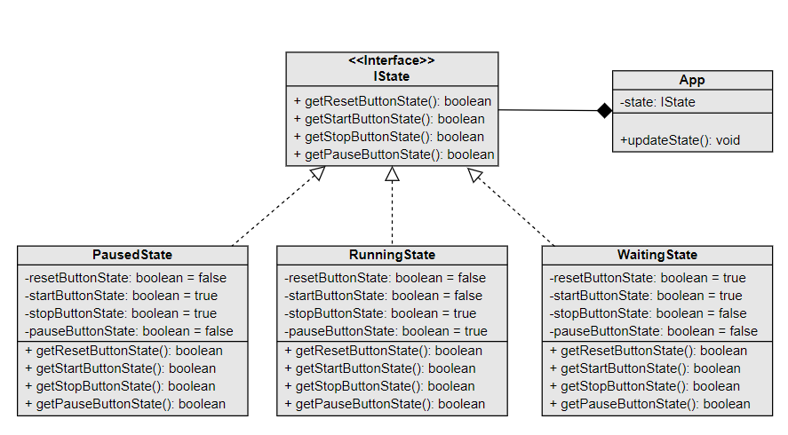

# Приложение «Таймер»

Приложение реализует базовый функционал описанной в ходе обучения программной системы. Оно написано с применением двух паттернов проектирования и принципов SOLID.

## Использованные паттерны проектирования

### Фабричный метод (Factory Method)

Фабричный метод применяется для создания отдельных кнопок и панелей кнопок в большом количестве.

### Состояние (State)

Паттерн состояния применяется для описания текущего состояния таймера и вывода соответствующего набора управляющих кнопок. Например, в состоянии ожидания пользователь видит кнопки «Сбросить» и «Старт», в состоянии отсчёта — «Стоп» и «Пауза», а в состоянии паузы — «Стоп» и «Старт».

### Одиночка (Singleton) — паттерн, который не стоит применять

- Одиночка обеспечивает, что класс имеет только один экземпляр, и предоставляет глобальную точку доступа к этому экземпляру.
- Таймеры обычно не требуют глобального состояния, и ограничение на один экземпляр может ограничить гибкость и масштабируемость приложения.
- Вместо класса-одиночки лучше использовать стандартный класс Timer, не боясь пересоздавать его в случае необходимости.

## SOLID

### Принцип единственной ответственности

Все классы созданы для выполнения определённой функции, все кроме основного (`App`) имеют один метод (зачастую перегруженный) для выполнения этой функции.

### Принцип открытости/закрытости

Созданные классы можно расширять, но нельзя изменять их функционал. Например, в классы состояний можно добавить обработку новых кнопок, а в фабрике кнопок — перегрузить метод их создания.

### Принцип подстановки Лисков

Любой класс состояния, наследуемый от `IState`, можно подставить в атрибут `state` класса `App`. Он универсально обрабатывает любое состояние, созданное под существующие кнопки.

### Принцип разделения интерфейса

Класс `App` реализует два интерфейса — `ITimerWindow`, описывающий методы управления графическим интерфейсом, и `ITimerController`, описывающий методы управления самим таймером.

### Принцип инверсии зависимостей

Класс `App` при определении своего состояния зависит лишь от интерфейса `IState`, а не от конкретных состояний вроде `PausedState` или `RunningState`.
